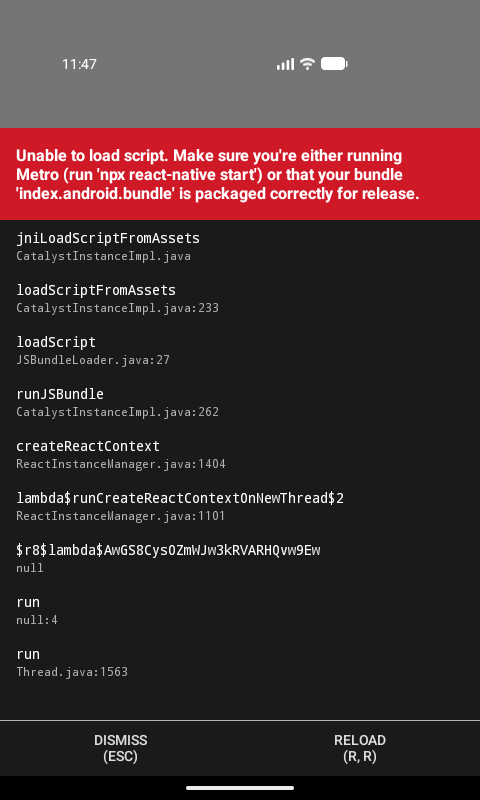
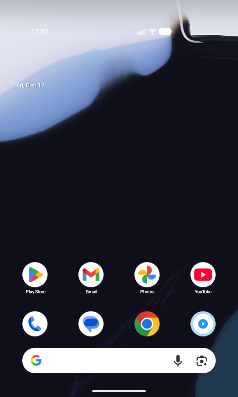

# 🧪 SmartLab HMI Controller

<p align="center">
  
</p>

<p align="center">
  <strong>A modern mobile Human-Machine Interface for smart lab equipment</strong>
</p>

<p align="center">
  <a href="#-live-demo">Live Demo</a> •
  <a href="#-features">Features</a> •
  <a href="#-screenshots">Screenshots</a> •
  <a href="#-installation">Installation</a> •
  <a href="#-architecture">Architecture</a>
</p>

---

## 📱 What is SmartLab HMI Controller?

**SmartLab HMI Controller** is a mobile app that acts as the control panel for a smart lab device.

> *"The app you use to monitor lab equipment in real time and control it safely from your phone."*

It replaces or extends the physical buttons, LEDs, and small displays on lab equipment with a richer, touch-based interface following **Apple Human Interface Guidelines** for a clean, intuitive user experience.

---

## 🔬 What Does It Control?

The app connects to a **SmartLab device** (environmental chamber, sensor hub, or lab controller box) that has:

### 🌡️ Sensors
- **Temperature** monitoring (°C)
- **Humidity** monitoring (%)
- Expandable to pressure, gas levels, etc.

### 💡 LED Status & Alerts
- Turn LED **on/off** from the app
- Color/blink patterns based on status:
  - 🟢 **Normal** - Everything OK
  - 🟡 **Warning** - Approaching threshold
  - 🔴 **Critical** - Threshold exceeded

### ⚙️ Operating Modes
- **Auto Mode** - Device decides based on sensor readings
- **Manual Mode** - User directly controls outputs

### 🎚️ Safety Thresholds
- Set temperature/humidity thresholds from the app
- When readings cross thresholds:
  - App shows warnings (animations, color changes)
  - Device triggers LEDs or alarms

### 📊 Data Streaming
- Start a "session" for constant data streaming
- Stop streaming to save power/bandwidth
- All readings stored for later analysis

### 🔮 Future Expansions
- Fan on/off control
- Pump on/off control
- "Experiment profiles" (e.g., maintain 25-27°C for 30 minutes)

---

## 🎯 Real-Life Use Cases

A **lab technician or engineer** wants to monitor and control a small lab setup (sensor box in a growth chamber or test rig) without being next to it:

1. **Open the SmartLab HMI Controller app** on Android
2. **Connect to device** via BLE (nearby) or Wi-Fi/WebSockets (remote)
3. **See live readings** - temperature, humidity in real-time
4. **Adjust modes and thresholds** - switch between Auto/Manual
5. **Get visual warnings** - if something goes out of range
6. **Review history** - all data saved to database

### Primary Uses:
| Use Case | Description |
|----------|-------------|
| **Monitoring** | Real-time view of lab device conditions from your phone |
| **Control** | Safely change device behavior (LEDs, modes, thresholds) |
| **HMI/UX** | Modern graphical interface replacing physical controls |
| **Data Logging** | All readings and commands saved for analysis |

---

## 📸 Screenshots

<p align="center">
  
  
  
</p>

<p align="center">
  
  
</p>

| Screen | Description |
|--------|-------------|
| **Login** | Clean Apple-style authentication screen |
| **Device List** | View all registered SmartLab devices |
| **Dashboard** | Real-time 3D gauge with temperature/humidity readings |
| **Control Panel** | LED control, mode switching, threshold adjustment |
| **BLE Scan** | Discover nearby SmartLab devices via Bluetooth |

---

## 🚀 Live Demo

### Try it with Expo Go! 📲

Scan the QR code below with the **Expo Go** app to run SmartLab HMI instantly:

<p align="center">
  
</p>

**Or open directly:**
```
exp://u.expo.dev/smartlab-hmi
```

> **Note:** Download [Expo Go](https://expo.dev/client) from Play Store/App Store first.

### Run Locally

```bash
# Clone the repository
git clone https://github.com/Kiran-kata/smartlab-hmi.git
cd smartlab-hmi

# Start the backend
cd backend
npm install
npm run dev

# Start the mobile app (in another terminal)
cd mobile
npm install
npx expo start
```

---

## ✨ Features

### 📱 Mobile App (React Native + TypeScript)
- **Apple HIG Design** - Clean, modern iOS-style interface
- **Real-time Dashboard** - 3D animated gauge visualization
- **BLE Connectivity** - Connect to nearby devices via Bluetooth
- **WebSocket Streaming** - Live sensor data updates
- **Offline Mock Mode** - Works in emulator with simulated data
- **Lottie Animations** - Smooth loading and success animations

### 🖥️ Backend (Node.js + TypeScript)
- **REST API** - Device registration, readings, commands
- **WebSocket Server** - Real-time pub/sub for live data
- **PostgreSQL** - Persistent storage (with in-memory fallback)
- **Health Monitoring** - `/health` endpoint for status checks

### 🔌 Device Protocol
- **BLE GATT** - Custom service/characteristics for commands
- **JSON Commands** - LED_ON, LED_OFF, MODE_AUTO, MODE_MANUAL, SET_THRESHOLD
- **Sensor Notifications** - Temperature, humidity, status updates

---

## 🏗️ Architecture

```
┌─────────────────┐     BLE      ┌─────────────────┐
│   SmartLab      │◄────────────►│   Mobile App    │
│   Device        │              │   (React Native)│
│   (ESP32)       │              │                 │
└────────┬────────┘              └────────┬────────┘
         │                                │
         │ Wi-Fi                          │ HTTP/WS
         │                                │
         ▼                                ▼
┌─────────────────────────────────────────────────┐
│              Backend Server                      │
│              (Node.js + Express)                 │
│                                                  │
│  ┌──────────┐  ┌──────────┐  ┌──────────────┐  │
│  │ REST API │  │WebSocket │  │  PostgreSQL  │  │
│  │ /devices │  │  Pub/Sub │  │   Database   │  │
│  │ /readings│  │          │  │              │  │
│  └──────────┘  └──────────┘  └──────────────┘  │
└─────────────────────────────────────────────────┘
```

### Data Flow

1. **Device → Backend**: Sensor readings via Wi-Fi (MQTT/HTTP)
2. **Backend → App**: Real-time updates via WebSocket
3. **App → Device**: BLE commands for local control
4. **App → Backend**: REST API for device management

---

## 📂 Project Structure

```
smartlab-hmi/
├── 📁 backend/              # Node.js backend server
│   ├── src/
│   │   ├── routes/         # REST API endpoints
│   │   ├── repositories/   # Data access layer
│   │   ├── websocket/      # WebSocket handlers
│   │   └── server.ts       # Entry point
│   └── package.json
│
├── 📁 mobile/               # React Native app
│   ├── src/
│   │   ├── screens/        # UI screens
│   │   ├── components/     # Reusable components
│   │   ├── services/       # API, BLE, WebSocket
│   │   ├── theme/          # Apple HIG design system
│   │   └── types/          # TypeScript definitions
│   ├── android/            # Android native code
│   │   └── app/src/main/java/.../SmartBle.kt
│   └── package.json
│
├── 📁 device/               # Firmware documentation
│   └── protocol.md         # BLE/MQTT protocol spec
│
├── 📁 screenshots/          # App screenshots
│
└── 📁 docs/                 # Documentation
    ├── requirements.md
    ├── architecture.md
    └── api.md
```

---

## 🛠️ Tech Stack

### Frontend (Mobile)
| Technology | Purpose |
|------------|---------|
| React Native | Cross-platform mobile framework |
| TypeScript | Type-safe JavaScript |
| React Navigation | Screen navigation |
| Lottie | Animations |
| Three.js (WebView) | 3D gauge visualization |
| Expo | Development & deployment |

### Backend
| Technology | Purpose |
|------------|---------|
| Node.js | Runtime environment |
| Express.js | REST API framework |
| WebSocket (ws) | Real-time communication |
| PostgreSQL | Database |
| TypeScript | Type-safe code |

### Device
| Technology | Purpose |
|------------|---------|
| ESP32 | Microcontroller |
| BLE GATT | Local wireless control |
| Wi-Fi | Backend communication |

---

## 📦 Installation

### Prerequisites
- Node.js 18+
- npm or yarn
- Android Studio (for emulator)
- PostgreSQL (optional, has in-memory fallback)

### Backend Setup

```bash
cd backend
npm install

# Create .env file (optional)
echo "DB_HOST=localhost
DB_PORT=5432
DB_USER=smartlab
DB_PASS=smartlab
DB_NAME=smartlab
PORT=4000" > .env

# Start server
npm run dev
```

### Mobile Setup

```bash
cd mobile
npm install

# For Expo (recommended)
npx expo start

# For React Native CLI
npx react-native run-android
```

---

## 🔌 API Reference

### REST Endpoints

| Method | Endpoint | Description |
|--------|----------|-------------|
| GET | `/health` | Health check |
| GET | `/devices` | List all devices |
| POST | `/devices` | Register new device |
| GET | `/devices/:id` | Get device details |
| GET | `/devices/:id/readings` | Get sensor readings |
| POST | `/devices/:id/commands` | Send command to device |

### WebSocket Events

| Event | Direction | Description |
|-------|-----------|-------------|
| `subscribe` | Client → Server | Subscribe to device updates |
| `reading` | Server → Client | New sensor reading |
| `command` | Client → Server | Send command |
| `status` | Server → Client | Device status change |

---

## 🤝 Contributing

1. Fork the repository
2. Create your feature branch (`git checkout -b feature/amazing-feature`)
3. Commit your changes (`git commit -m 'Add amazing feature'`)
4. Push to the branch (`git push origin feature/amazing-feature`)
5. Open a Pull Request

---

## 📄 License

This project is licensed under the MIT License - see the [LICENSE](LICENSE) file for details.

---

## 👨‍💻 Author

**Kiran Kata**

- GitHub: [@Kiran-kata](https://github.com/Kiran-kata)

---

<p align="center">
  Made with ❤️ for smart lab automation
</p>
